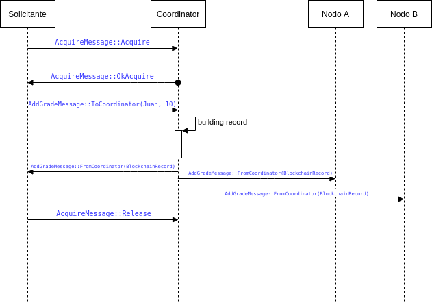

# Trabajo Práctico 3 - Informe

|Integrante|Padrón|Mail|
|----------|------|----|
|Botalla, Tomás| 96356 | tbotalla@fi.uba.ar |
|Alvarez, Dylan| 98225 | dylanalvarez1995@gmail.com |
|Donato, Juan Pablo| 100839 | judonato@fi.uba.ar |

## Introducción

El objetivo de este informe será presentar y detallar las soluciones implementadas por el grupo 1 para la construcción del trabajo práctico 3, el cuál consistió en implementar una *blockchain rústica* de forma distribuida, considerando los distintos escenarios para lograr la implementación adecuada de dos algoritmos de **exclusion mútua distribuida** y de **elección de lider**.

En esta oportunidad, decidimos cumplir con la implementación de ambos algoritmos, utilizando:

- **Algoritmo de Bully**
- **Algoritmo Centralizado**

Adicionalmente detallamos el algoritmo de sincronización de un nuevo nodo para permitir la reconexión de un nodo caído:

- **Algoritmo de sincronización de un nuevo nodo**

## Algoritmo de elección de lider - Algoritmo Bully

Para la parte de la elección de un nodo *lider* o *coordinador*, que será quien lleve las riendas de la sincronización para insertar elementos en la Blockchain de forma exitosa, decidimos implementarlo utilizando un algoritmo de tipo **Bully**, en donde la elección del coordinador se basa en un criterio simple de que el nodo con mayor número de puerto en la red es quien será el coordinador. Dicho algoritmo se ejecuta ante la presencia de dos eventos:

- Cuando un nodo se levanta. Se ejecuta el algoritmo de elección para que los nodos descubran quien es el coordinador actual, o bien si el nodo nuevo lo es, para  poder comenzar a operar.
- Cuando un nodo detecta que el coordinador actual "esta caido". Si un nodo al enviarle mensajes realizando peticiones para insertar el siguiente dato en la cadena no recibe respuesta en un tiempo apropiado, entonces considerará al nodo coordinador como fuera de servicio, forzando una eleccion del lider nuevamente.

El proceso en cuestión implica:

1. El nodo que comienza la elección envía, solamente a quienes tengan número de puerto mas grande que el propio del nodo, un mensaje del tipo `ElectionMessage::Election` por la red, indicando el comienzo del proceso de elección de lider.
2. Cuando cada nodo reciba un mensaje de este tipo deberá responder al emisor con un mensaje `ElectionMessage::OkElection`, e iniciar el proceso de elección de lider, repitiendo el paso (1).
3. Si un determinado nodo NO recibe el mensaje `ElectionMessage::OkElection` de ningun otro nodo entonces *éste deberá proclamarse como coordinador*. En este caso, enviará por la red a TODOS los nodos restantes un mensaje `ElectionMessage::Coordinator`, autoproclamandose como lider o coordinador. Cuando los demás nodos lo reciban, actualizarán su referencia al nuevo nodo coordinador.

## Algoritmo de Exclusión Mutua - Algoritmo Centralizado

En este caso, hemos elegido cumplir esta parte del trabajo implementando un algoritmo de *exclusion mútua distribuida*. Básicamente, se trata de un "mutex" distribuido el cuál los nodos necesariamente necesitan adquirir previo a intentar agregar algun elemento en la *blockchain*. Dicho mutex estará unicamente administrado por el nodo coordinador de turno. El procedimiento a grandes rasgos es el siguiente:

1. Al recibir un mensaje del tipo `add_grade <nombre_alumno> <nota>` por la interfaz de comandos, el nodo deberá solicitar el mutex al nodo coordinador (enviando un mensaje del tipo `AcquireMessage::Acquire`). Luego, no procederá al siguiente paso hasta no recibir una confirmación por parte del nodo supervisor.
2. El coordinador, al recibir esta petición deberá evaluar lo siguiente:
   1. Si el mutex distribuido esta *tomado* por otro nodo actualmente, entonces simplemente encolará el pedido para responderlo apenas se libere.
   2. Si el mutex *no estaba tomado*, entonces lo reserva para este solicitante y le envia la confirmación de que puede continuar (mediante el envio del mensaje `AcquireMessage::OkAcquire`).
3. Cuando el solicitante reciba la confirmación, procederá a insertar el dato nuevo en la blockchain. Para eso, enviará un mensaje al coordinador del estilo `AddGradeMessage::ToCoordinator(Juan, 10)`.
   1. Si no recibiera la confirmación en un tiempo apropiado, el nodo considerará al coordinador como "fuera de linea", disparando el proceso de elección de lider nuevamente.
4. Cuando el coordinador reciba el mensaje para insertar el dato en la Blockchain, lo reenviará a todos sus vecinos en un mensaje del estilo `AddGradeMessage::FromCoordinator(BlockchainRecord)`, en el cuál especifica concretamente cómo es el nuevo bloque a insertar (nombre, nota y hash).
   1. Al recibir este mensaje, todos los nodos insertan el nuevo record en su Blockchain
5. Cuando termina de enviar el mensaje `AddGradeMessage::ToCoordinator(Juan, 10)` al coordinador, el nodo solicitante enviará un mensaje `AcquireMessage::Release` al coordinador para liberar el mutex, y disponibilizarlo para futuras peticiones.



## Algoritmo de sincronización de un nuevo nodo

Cuando un nuevo nodo se conecta necesita sincronizar su blockchain con la de los demás nodos antes de empezar a aceptar nuevos registros en la misma. Para lograr esto el procedimiento es el siguiente:

1. Al iniciar el nodo, el mismo envía un mensaje de tipo `BlockchainMessage::AskForBlockchain` a todos sus vecinos y se queda bloqueado esperando una respuesta de tipo `BlockchainMessage::BlockchainResult`.
2. Sus vecinos, al recibir el mensaje `BlockchainMessage::AskForBlockchain` evalúan si son el coordinador, y en caso afirmativo el que es coordinador le responde al nuevo nodo con un mensaje de tipo `BlockchainMessage::BlockchainResult` que contiene la blockchain completa del coordinador.
3. El nuevo nodo al recibir la blockchain completa por el mensaje `BlockchainMessage::BlockchainResult`, se la guarda y destraba el bloqueo del punto 1 para comenzar el proceso de elección
4. Si el nuevo nodo no recibiera ningún mensaje de tipo `BlockchainMessage::BlockchainResult` significa que los vecinos no están operativos. Por lo tanto después de un timeout en el punto 1, se desbloquea el nodo para poder comenzar el proceso de elección y empezar a procesar nuevos registros con la blockchain vacía.

## Modo de uso
En primera instancia se deberá compilar el proyecto con:
`cargo build`

Para iniciar los nodos se les debe especificar como primer parámetro el puerto propio y como siguientes parámetros las direcciónes de sus vecinos separadas por espacios:
```
# Iniciar el nodo escuchando en el puerto 6060 y con vecinos con puertos 6061 y 6062
cargo run 6060 127.0.0.1:6061 127.0.0.1:6062

# Iniciar el nodo escuchando en el puerto 6061 y con vecinos con puertos 6060 y 6062
cargo run 6061 127.0.0.1:6060 127.0.0.1:6062

# Iniciar el nodo escuchando en el puerto 6062 y con vecinos con puertos 6060 y 6061
cargo run 6062 127.0.0.1:6060 127.0.0.1:6061
```

Comandos que acepta un nodo:
```
add_grade <nombre> <nota> : ejemplo add_grade juan 8. Solicita agregar la nota de juan con valor 8 a la blockchain.
print : imprime el estado actual de la blockchain.
quit : termina la ejecución del nodo.
ping : envía un mensaje de PING a los nodos vecinos. Usado solo para debug.
make_coordinator : fuerza al nodo a identificarse a si mismo como coordinador. Usado solo para debug. 
begin_election : fuerza al nodo a iniciar el proceso de elección de lider. Usado solo para debug.
clear : limpia la terminal.
```

## Conclusiones del trabajo práctico


Con la implementación del trabajo práctico pudimos aprender y llevar a concreto ciertos conceptos que desarrollamos en la segunda parte de la materia. Entre ellos:

- Implementación de un algoritmo de elección de lider, como fue la implementacion del algoritmo *bully*.
- Implementacion de algoritmo de exclusion mutua, como fue la implementacion del *mutex distribuido*, administrado por el coordinador.
